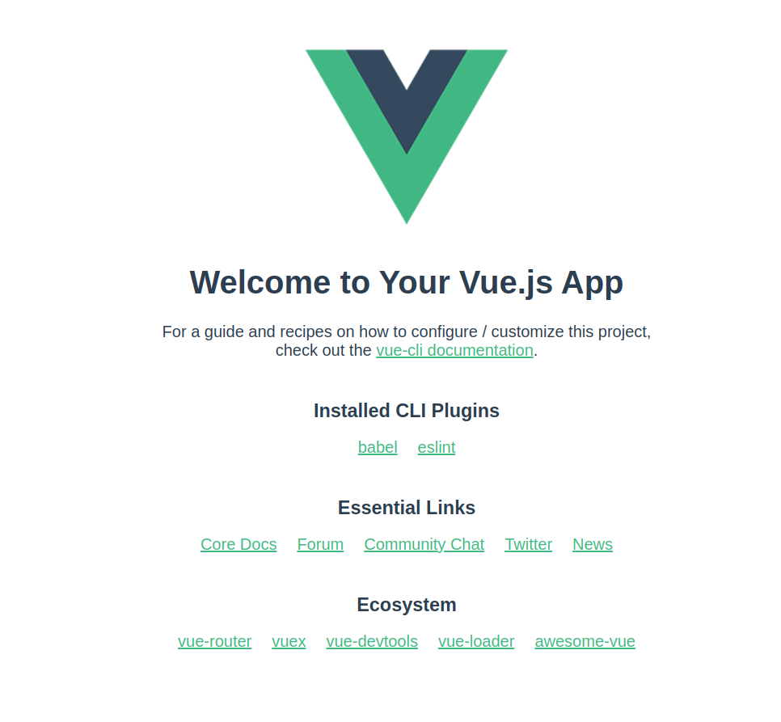

# 환경구성

- 기본적으로 npm 이나 yarn 이 설치되어 있어야 한다.

```
sudo yarn add global @vue/cli
vue --version
```

### 프로젝트 생성

```
vue create 프로젝트명\
```

### 프로젝트 실행

```
yarn serve
```

- 실행화면

- md 에서는 이미지 사이즈의 조절을 지원하지 않음. html Img 태그를 사용해야 함
  잘 동작 안함

<!--  width = "100" height = "100"</img> -->

{width="100" height="100"}
